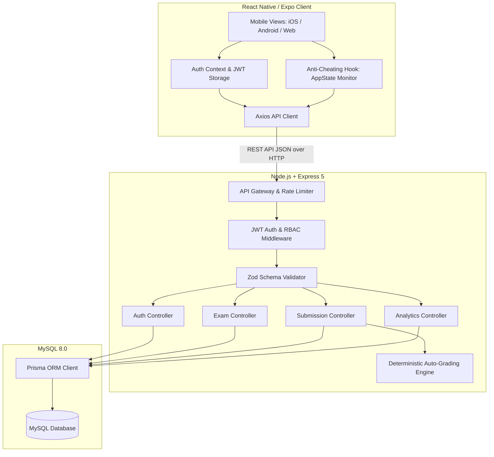
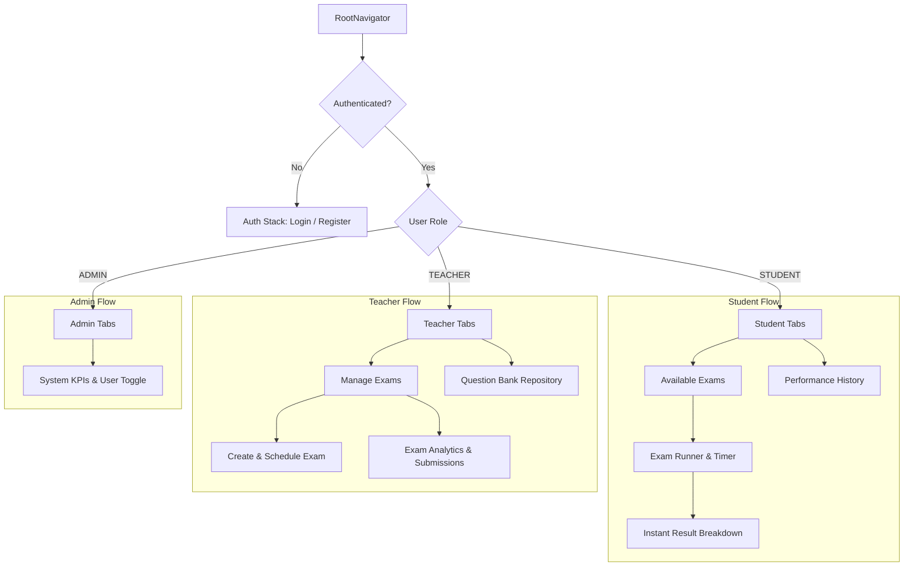
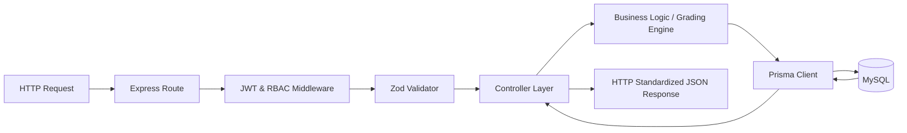
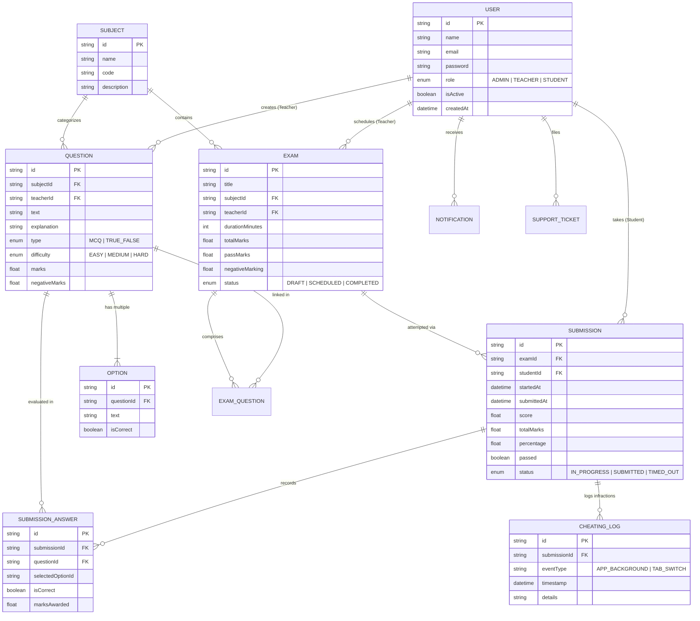
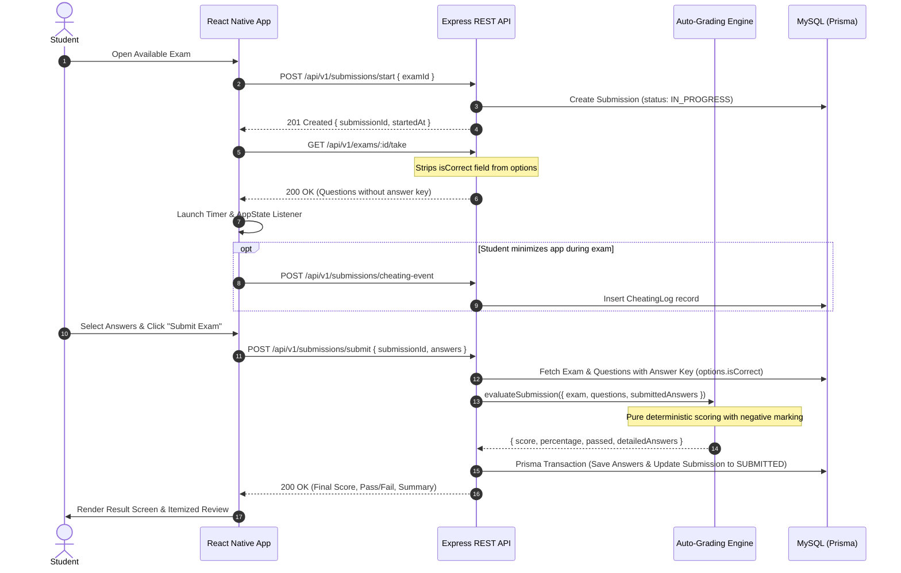

# System Architecture & Technical Design

**Project**: Online Exam Application with Auto-Grading  
**Stack**: React Native (Expo), Node.js (v22), Express.js (v5), MySQL (8.0), Prisma ORM

---

## 1. High-Level System Architecture

The system employs a decoupled, client-server architecture. The cross-platform mobile client communicates over HTTPS/JSON REST APIs with an Express.js application gateway, which orchestrates authentication, exam sessions, deterministic auto-grading, and persists relational data to MySQL via Prisma ORM.

---

## 2. Frontend Architecture (React Native)

The mobile client uses React Navigation with role-based segregation, preventing unauthorized route mounts on the client device.

---

## 3. Backend Layered Architecture

The backend strictly follows the **Controller-Service-Data** separation of concerns:

---

## 4. Database Entity-Relationship Diagram (ERD)

---

## 5. Auto-Grading & Exam Lifecycle Sequence Diagram

